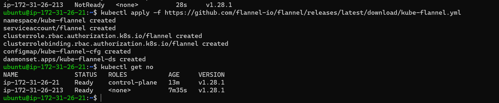
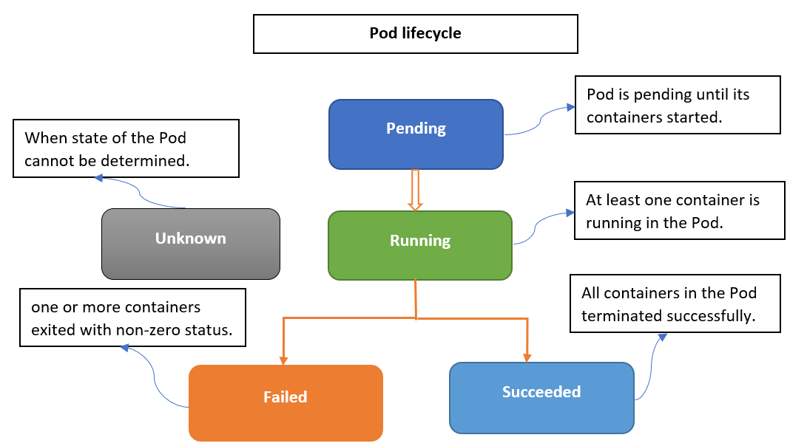
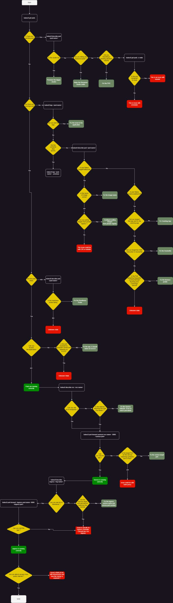

# Kubernetes


Is an open-source orchestration system for Docker containers.

- Lets you schedule containers on a cluster of machines
- You can run multiple containers on one machine
- You can run long running services (like web applications)
- Managed the state of these containers
  - Can start container on specific nodes
  - Will restart a container when it gets killed
  - Can move containers from one node to another node

- Instead of running a few docker containers manually. Kubernetes manages it for you.
- Clusters can start with one node until thousands of nodes
- Some other popular container orchestrations are
  - Kubernetes
  - Apache Mesos
  - Hashicorp Nomad
  - Docker Swarm
  - Amazon ECS

Kubernetes:
  - On-premise
  - Public (AWS)
  - Hybrid: public & private

- Highly modular
- Open source
- Backed by Google

### Docker Engine

- Docker runtime
- Software to run docker images

Docker Hub

- Online service to store and fetch docker images
- Also allows you to build docker images online

Kubernetes can be ran anywhere (except more integrations exists for AWS/GCE/Azure)

- Things like Volumes and External Load Balancers work only with supported Cloud Providers
- Minikube - run Kubernetes locally


### MiniKube Installation(1.28)

excuting all commands both Nodes
```yml
sudo apt update
sudo apt install docker.io
sudo usermod -aG docker ubuntu
- we have to exit your machine and relogin again
docker info
```
- To install CRI-dockerd 
```yml
wget https://github.com/Mirantis/cri-dockerd/releases/download/v0.3.4/cri-dockerd_0.3.4.3-0.ubuntu-jammy_amd64.deb

```
- lets excute all commands both nodes(Master&Node)
```yml
sudo dpkg -i cri-dockerd_0.3.4.3-0.ubuntu-jammy_amd64.deb
sudo apt-get update
sudo apt-get install -y apt-transport-https ca-certificates curl
curl -fsSL https://pkgs.k8s.io/core:/stable:/v1.28/deb/Release.key | sudo gpg --dearmor -o /etc/apt/keyrings/kubernetes-apt-keyring.gpg
echo 'deb [signed-by=/etc/apt/keyrings/kubernetes-apt-keyring.gpg] https://pkgs.k8s.io/core:/stable:/v1.28/deb/ /' | sudo tee /etc/apt/sources.list.d/kubernetes.list
sudo apt-get update
sudo apt-get install -y kubelet kubeadm kubectl
```
Execute the following on master node
- Lets initialize the cluster using the following command as a root user on masterNode
```yml
- kubeadm init --pod-network-cidr "10.244.0.0/16" --cri-socket "unix:///var/run/cri-dockerd.sock"

  mkdir -p $HOME/.kube
  sudo cp -i /etc/kubernetes/admin.conf $HOME/.kube/config
  sudo chown $(id -u):$(id -g) $HOME/.kube/config
```
now we can excute the below command on Worker Node
```yml
kubeadm join 172.31.26.21:6443 --token uht9cw.03x0raodrvf6o75j \
        --discovery-token-ca-cert-hash sha256:792e73270dba37a81ec3b3e519982f2cc70a2429f7db431ffe6b1555471822b0 \
		--cri-socket "unix:///var/run/cri-dockerd.sock"
```


- Now kuberentes needs CNI Plugin so that pod-network is enabled. Till this is done the DNS doesnot work, services donot work so nodes are shown as NotReady. it will install flannel Network on Master Node
```yml
- kubectl apply -f https://github.com/flannel-io/flannel/releases/latest/download/kube-flannel.yml
```


### what is k8s

- what is k8s
  `k8s is a Container orchestration tool and it helps maintaing the containers`

### Containers: 

`Containers are lightweight, portable, and isolated environments that package applications and their dependencies`. They provide consistency across different environments, such as development, testing, and production.

### Orchestration Platform

The container orchestration platform is a software system or service that `manages containerized applications`. Popular container orchestration platforms include `Kubernetes, Docker Swarm, and Apache Mesos`.

###  what is container orchestration

  container orchestration nothing but `automation of the workloads`  such as  `deployment, scaling, networking , loadbalancing ,service discovery` and `manages containerized applicatons`.it will helps to deploy an application across different environments without any interruptions or need to redesign it.

### kubectl: kubernetes control

- `This is a command line tool to communicate with k8s api server.`
- Inside k8s we have a Certificate Authority and keys available which are used to secure all k8s communications.
- The kubeconfig file contians the certificate data to be connected securely as admin into k8s (This is based on installations which we have done so far)
  
## key features of k8s

#### High Availability:

  - `When we Run our Application in Docker Containers and if Containers fails we need to Manually Start the Conatiner(Container Down)`
  - `If the Node i.e The machine Fails all the Container Running on the same machine it Should be Re-Created on Other machine(Node Down)`
  
#### Auto Scaling

  - scaling there are two types
  - 
##### Horizontal Pod autoScaling

- Increasing number of Containers
  
##### Vertical Pod autoScaling
  
- Increasing Size of the Conatiner

#### Self-Healing

 - Kubernetes continuously monitors the health of applications and if Pod fail automatically replaces new Pod

#### Rolling Updates and Rollbacks

- k8s supports rolling updates it means enabling update your application wwithout Downtime and if any issues after updated your application and roll back to previous version 
  
### k8s architecture


### k8s components
- Control Plane or Master Node
  * kube-api Server
  * kube-scheduler
  * kube-controller-manager
  * etcd
* Worker Node or Slave
  * kubelet
  * container engine
  * kube-proxy
#### ectd 
* `This is memory of the k8s cluster or k8s uses etc to store all the cluster data`
* etcd cluster can scale across multiple nodes unlike traditional databases
* This is distribute key-value store
  
#### kube-apiserver
* `it will handels all communication of k8s cluster.let it be internal or external`
* This is most important component of the k8s control plane
* kube-api server exposes REST API which enables clients to send HTTP requests to kube-api server
* kube-api server responds over http requests and writes the resource information to etcd store
* kube-api server exposes the k8s objects
* kube-api server is responsible for all the communication
* The api server is over https and requires authentication
  
#### kube-scheduler
* `Scheduler is responsible for creating k8s objects(pods) and scheduling them on right node`

#### kube-controller-manager
* `This ensures desired state is maintained`
* This is combination of multiple controller
  - NodeController
  - Replication Controller
  - Namespace Controller
  - EndpointController
  - ServiceAccountController
#### kubelet
- `This is the agent of the control plane` 
- This reacts to requests/orders from control plane components and speaks with container runtime and gets the work done
- If it fails responds back to control plane with status

#### kube-proxy

- this is responsible for networking
- this implementations will be based on CNI

#### Container Runtime

- this is container engine
- this could be docker or any other CRI compatible runtime

## Pod lifecycle or States of a Pod

  
### Running:
Once all the containers in the POD starts, it goes in to running state.

### Pending: 
When the Pod’s metadata is accepted by the Kuberenetes but still hasn’t been deployed to any node, Pod goes into the Pending state.
  -  E.g. When Nodes do not have enough resources in the cluster, it causes the pod to go in pending state.
  
### Succeeded: 
When containers inside the the pod get terminated with exit code 0 then the pod goes into the Succeeded State.

### Failed:
 When one of the containers inside the pod gets terminated with exit code other than 0, It causes the pod to go into the Failed state.

### unknown
The Pod status couldn’t be obtained by the API server.

### CrashLoopBackoff
- When the containers inside the pod get failed to start then the pod is being recreated again and again.
- The apllication inside the container keeps crashing
- some type of parameters of the pod or container have been configured incompletely
   - example: Environmental varibles, parameters
- An error have been made when deploying k8s

## Container Orchestration Features

### Deployment:
Automatically deploy containerized applications to a cluster of machines.
- Scaling: Dynamically scale containers based on resource utilization or demand.
### Load Balancing:
Distribute incoming traffic across multiple containers to ensure high availability and even workload distribution.
### Service Discovery: 
Automatically discover and register services so that containers can communicate with each other.
### Rolling Updates:
Perform zero-downtime updates by gradually replacing old containers with new ones.
### Health Monitoring:
Continuously monitor the health of containers and automatically replace or restart failed ones.
### Resource Allocation:
Efficiently allocate CPU, memory, and other resources to containers.
Configuration Management: Manage application configuration, secrets, and environment variables.
### Storage Orchestration: 
- it Handle persistent storage for stateful applications.
### Container Clusters:
Container orchestration platforms manage a cluster of machines (nodes) that run containers. These nodes can be physical servers, virtual machines, or cloud instances.

### API and Command-Line Interface (CLI): 
Container orchestration platforms offer APIs and CLI tools that allow developers and operators to interact with and control the orchestration environment programmatically.

### Container Registry: 
A container registry is a repository for storing container images. Common container registries include Docker Hub, Google Container Registry, and AWS Elastic Container Registry (ECR).

### Networking: 
Container orchestration platforms provide networking solutions to enable communication between containers running on different nodes within the cluster.

### Persistent Storage: 
Some container orchestration platforms offer solutions for managing and provisioning persistent storage volumes for stateful applications.

### Secrets Management: 
Securely manage sensitive information such as passwords, API keys, and certificates required by containers.

### Monitoring and Logging: 
Integration with monitoring and logging tools helps track the performance and health of containers and applications.

### Security: 
Container orchestration platforms implement security features like role-based access control (RBAC), network policies, and container isolation to enhance application security

### k8s commands

- kubect apply -f <manifest File Name>
- kubect apply -f . <Dot means Current Directory>
- kubectl delete -f . <Dot means Current Directory>
- kubectl delete -f <mafifest File Name>
- kubectl get po or pods <it will shows all pods>
- kubectl get po -o wide 
- kubectl get po -w
- kubectl get po 'pod name' -o yml
- kubectl get po --show-labels
- kuectl describe po 'pod name'
- kubctl get po --all-namespaces
- kubectl get po -l <label name> for example app=nginx
- kubectl exec 'Pod Name' -it -- /bin/bash
- kubectl exec 'Pod Name' -it -c 'Container Name' -- /bin/bash 
- kubectl get po -o custom-columns=IP:status.podIP
- kubectl exec 'pod name' -- pwd or whoami
- kubectl exec 'Pod Name' -c 'Container Name' -- pwd or ifconfig
- kubectl config set-context --current --namespace=<namespace-name>

### ReplicaSet

Scaling: Scaling in k8s means increasing number of Pods not containers in Pod. For Scaling pods we would learn Replica set/Replication Controller etcs..

- kubectl get no
- kubectl get rs,po
- kubectl exec -it <Pod name> -- /bin/bash
  - printenv
### Annotations
- annotations are used external tools
- labels are used querry the information 
### Load Balancers

On AWS the load balancer will route the traffic to the correct pod in Kubernetes.

You can use haproxy or nginx load balancer in front of your cluster. Expose port directly.

To setup a service with a load balancer use:

```
apiVersion: v1
kind: Service
metadata:
  name: helloworld-service
spec:
  ports:
  - port: 80
    targetPort: nodejs-port
    protocol: TCP
  selector:
    app: helloworld
type: LoadBalancer
```
- kubectl get svc <svc name> -o yml | less
### Basics

Internet traffic is directed to a load balancer which then does a look-up on the iptables. IPTables then directs traffic to pods containing Docker containers. Kubelet/kube-proxy also does a look-up against iptables.

### Scaling

If your application is stateless then you can horizontally scale it.

- Stateless means that it doesn't write any local files or keep local sessions.
- All traditional databases (MySQL/Postgres) are stateful, they have database files that can't be split over multiple instances.

Most web applications can be made stateless.

- Session management needs to be done outside the container.
- Scaling in Kubernetes can be done using the Replication Controller.
- The replication controller will ensure a specified number of pod replicas will run at all time.
- A pods created with the replica controller will automatically be replaced if they fail, get deleted, or are terminated.
- Using the replication controller is also recommended if you just want to make sure 1 pod is always running, even after reboots
  - You can then run a plication controller with just 1 replica
  - This makes sure that the pod is always running

To replicate an app 2 times using the Replication controller:

```
apiVersion: v1
kind: ReplicationController
metadata:
  name: helloworld-controller
spec:
  replicas: 2
  selector:
    app: helloworld
  template:
    metadata:
      labels:
        app: helloworld
    spec:
      containers:
      - name: nginx
        port: nginx
        - containerPort: 80 
```

Via CLI you can use:

```
kubectl scale --replicas=4 -f config.yml
```

### Replication Set

- Replica Set is the next-generation Replication Controller
- It supports a new selector that can do selection based on filtering according to a set of values
  - "environment" can be "dev" or "qa"
  - not based on equality

- Replica Set is used by Deployment object
- replicaset: howmany replicas do you want
- Selector: How can i measure that number of replicas Running or not
- Template: What do you want we created for the replicas of
- some usefulcommands
   * kubectl get rs
   * kubectl get po --show-labels -w
   * kubectl describe rs <Pod Name>

- A deployment declaration in Kubernetes allows you to do app deployments and updates
- When using the deployment object, you define the state of your application
  - Kubernetes will then make sure the clusters matches your desired state
- Using the replication controller or replication set might be cumbersome to deploy apps
  - The Deployment Object is easier to use and gives you more possibilities

With a deployment object you can:

- Create a deployment (deploy an app)
- Update a deployment (deploy a new version of an app)
- Rolling updates (zero downtime deployments)
- Roll back to a previous version
- Pause/resume a deployment (e.g. to roll-out to only a certain percentage)

Example deployment:

```
apiVersion: v1
kind: Deployment
metadata:
  name: helloworld-deployment
spec:
  replicas: 3
  template:
    metadata:
      labels:
        app: helloworld
    spec:
      containers:
      - name: k8s-demo
        image: k8s-demo
        ports:
        - containerPort: 3000
```

Useful commands for deployment:

```
kubectl get deploy,rs,po
kubectl get deployments - Get information on current deployments
kubectl get rs - Get information about replica sets
kubectl get pods --show-labels - get pods, and also show labels attached to those pods
kubectl rollout status deployment/helloworld - Get deployment status
kubectl set image deployment/helloworld k8s-demo=k8s-demo:2 - Run k8s-demo with image label version 2
kubectl edit deployment/helloworld-deployment - Edit the deployment object
kubectl rollout status deployment/helloworld-deployment - Get status of the rollout
kubectl rollout history deployment/helloworld-deployment - Get the rollout history
kubectl rollout undo deployment/helloworld-deployment - Rollback to previous version
kubectl rollout undo deployment/helloworld-deployment --to-revision=n - Rollback to any version
```

### Services: 

- Pods are very dynamic, they come and go on the Kubernetes cluster
  - When using a Replication Controller, pods are terminated and created during scaling operations
- When using Deployments, when updating the image version, pods are terminated and new pods take the place of older pods
- A service is the logical bridge between the "mortal" pods and other services or end-users
- kubectl expose creates a new service for your pod.
- Creating a service will create an endpoint for your pod(s):
  - A ClusterIP: a virtual IP address only reachable from within the cluster
  - A NodePort: a port that is the same on each node that is reachable externally
  - A LoadBalancer: a LoadBalancer created by the cloud provider that will route external traffic to every node on the NodePort (ELB on AWS)
- The options just shown only allow you to create virtual IPs or ports
- There is also a possibility to use DNS names
  - ExternalName can provide a DNS name for the service
  - e.g. for service discovery using DNS
  - This only works when the DNS add-on is enabled

Example Service definition:

```
apiVersion: v1
kind: Service
metadata:
  name: helloworld-service
spec:
  ports:
  - port: 31001
    nodePort: 31001
    targetPort: nodejs-port
    protocol: TCP
  selector:
    app: helloworld
  type: NodePort
```
- kubectl get pods -o wide
- kubectl exec <Pod name-1> -it -- /bin/bash
    - ping -C <Pod-2 IP adress>
    - cat /etc/reslov.conf <DNS Name of the server>
-  Node to Pod Communication ping -c 1 <Pod-2 Ip adress>
-  nslookup <svc Name>
-  curl or wget <svc ip or name> 
-  kubectl get endpoints <svc name>
-  kubectl describe svc <Service Name>
-  curl <svc IP adress>
-  curl <svc Name.Name space>
-  apt update && apt install dnsutils
-  dig <pod ip>
-  nslookup <pod ip>
- in Node cat /etc/resolv.conf
Default services can only run between ports 30000 - 32767, but you can change this behavior by using --service-node-port-range= to kube-apiserver.

### Labels
Label is a key pair examples are
app: nginx
version: v1.0
Labels are used to select/query kubernetes objects
Selectors in k8s help in querying objects using labels
selectors are of two types
Equality Based Selectors
ex: kubectl get po -l env=dev or env=!dev
Set based selectors

- Key/value pairs that can be attached to objects
  - Labels are like tags in AWS or other cloud providers, used to tag resources
- You can label your objects, for instance your pod.
  - Key: env - Value: dev / qa
  - Key: department - Value: engineering
- Labels are not unique and multiple labels can be added to one object
- Once labels are attached to an object, you can use filters to narrow down results (Label Selectors)
- Using Label Selectors, you can use matching expressions to match labels
  - For instance, a particular pod can only run on a node labeled with "env": "dev"
- More complex matching: "env": "dev" or "qa"

### Node Labels

- You can also use labels to tag nodes
- Once nodes are tagged, you can use label selectors to let pods only run on specific nodes
- There are 2 steps required to run a pod on a specific set of nodes:
  - First you tag the node
  - Then you add a nodeSelector to your pod configuration

To add a label use:

```
kubectl label nodes node1 hardware=high-spec
kubectl label nodes node2 hardware=low-spec
```

Then add a pod that uses those labels:

```
apiVersion: v1
kind: Pod
metadata:
  name: helloworld-service
  labels:
    app: helloworld
spec:
  containers:
  - name: k8s
    image: k8s
    ports:
    - containerPort: 3000
  nodeSelector:
    hardware: high-spec
```

### Health Checks

- If your application malfunctions, the pod and container can still be running, but the application might not work anymore.
- To detect and resolve problems with your application, you can run health checks.
- You can run 2 different type of health checks
  - Running a command in the container periodically
  - Periodic checks on a URL (HTTP)
- The typical production application behind a load balancer should always have health checks implemented in some way to ensure availability and resiliency of the app.

Example of health checks:

```
apiVersion: v1
kind: Pod
metadata:
  name: nodehelloworld.example.com
  labels:
    app: helloworld
spec:
  containers:
  - name: k8s
    image: k8s
    ports:
    - containerPort: 3000
    livenessProbe:
      httpGet:
        path: /
        port: 3000
      initialDelaySeconds: 15
      timeoutSeconds: 30
```
### CronJob

- kubectl apply -f <Manifest Name>
- kubectl get cronjobs.batch
- kubectl get jobs.batch
- kubectl get pods
- kubectl delete 
- kubectl delete -f <Manifest Name> 
- Jobs excutes Once but CronJob excutes many times
### Secrets

- Secrets provides a way in Kubernetes to distribute credentials, keys, passwords or "secret" data to the pods.
- Kubernetes itself uses this Secrets mechanism to provide the credentials to access the internal API.
- You can also use the same mechanism to provide secrets to your application.
- Secrets is one way to provide secrets, native to Kubernetes.
  - There are still other ways your container can get its secrets if you don't want to use Secrets (e.g. using an external vault service)
- Can be used as environment variables.
- Use secrets as a file in a pod
  - This setup uses volumes to be mounted in a container
  - In this volume you have files
  - Can be used for instance for dotenv files or your app can just read this file
- Use an external image to pull secrets (from a private image registry)

To generate secrets using files:

```
kubectl create secret generic db-user-pass --from-file=./username.txt --from-file=./password.txt
```

A secret can also be generated from an SSH key or SSL certificate:

```
kubectl create secret generic ssl-certificate --from-file=ssh-privatekey=~./ssh/id_rsa --ssl-cert-=ssl-cert=mysslcert.crt
```

To generate secrets using yaml definitions:

secrets-db-secret.yml

```
apiVersion: v1
kind: Secret
metadata:
  name: db-secret
type: Opaque
data:
  password:
  username:
```

Then use:

```
kubectl create -f secrets-db-secret.yml
```

Using secrets:

```
spec:
  env:
    - name: SECRET_USERNAME
    valueFrom:
      secretKeyRef:
        name: db-secret
        key: username
    - name: SECRET_PASSWORD
```

Or:

```
spec:
  volumeMounts:
  - name: credvolume
    mountPath: /etc/creds
    readOnly: true
  volumes:
  - name: credvolume
    secret:
      secretName: db-secrets
```


### Advanced Topics

#### Service Discovery

As of Kubernetes 1.3 DNS is built-in that's launched automatically.

- The addons are in the /etc/kubernetes/addons directory on master node.
- The DNS service can be used within pods to find other services running on the same cluster
- Multiple containers within 1 pod don't need this service, as they can contact each other directly
- A container in the same pod can connect the port of the other container using localhost:port.
- To make DNS work, a pod will need a Service definition

You only need the name of the service to get back the IP address of the pod so long as they're in the same namespace.

### Config Map

- Config Map nothing but key,value store
- Configuration parameters that are not secret, can be put in a ConfigMap.
- The input is key - value pairs.
- The ConfigMap key-value pairs can then be read by the app using:
  - Environment variables
  - Container command-line arguments
  - Using volumes
- The ConfigMap can also contain full configuration files
- This file can be mounted using volumes where the application expects its config file
- This way you can inject configuration settings into containers without changing the container itself

To generate configmap using files:

```
cat <<EOF > app.properties
driver=jdbc
database=postgres
lookandfeel=1
otherparams=xyz
param.with.hierarchy=xyz
EOF
```

```
kubectl create configmap app-config --from-file=app.properties
```

```
spec:
  containers:
  volumeMounts:
  - name: config-volume
    mountPath: /etc/config
  volumes:
  - name: config-volume
    configMap:
      name: app-config
  env:
    - name: DRIVER
      valueFrom:
        configMapKeyRef:
          name: app-config
          key: driver
    - name: DATABASE
```

To return the ConfigMap use:

```
kubectl get configmap app-config
```

### Ingress

- Allows inbound connections to the cluster
- It's an alternative to the external LoadBalancer and nodePorts
  - Allows you to easily expose services that need to accessible from outside the cluster
- With Ingress you can run your own ingress controller (basically a loadbalancer) within the Kubernetes cluster
- There are default Ingress controllers available, or you can write your own ingress controller

Scenario:

Internet -> Ingress Controller (NGINX) -> pod 1
Internet -> Ingress Controller (NGINX) -> pod 2

```
apiVersion: extensions/v1beta1
kind: Ingress
metadata:
  name: helloworld-rules
spec:
  rules:
  - host: helloworld-v1.example.com
    http:
      paths:
        - path: /
          backend:
            serviceName: helloworld-v1
            servicePort: 80
```

### Kubernetes Volumes
- Volumes: These are ephemeral nothing but temporaro storage
  - Storage Classes: 
    - how to create ait actual storage
    - it will give storage to the Cluster.storege classes internally creates provisioner
    -  this k8s storage class basically helps you in creating some kind of a storage which can by used by Persitent Volumes
-  Persistent Volume: the disc which will given to you 
- Persistent Volume Claim:  
- Volumes in Kubernetes allow you to store state outside the container
- When a container stops, all data on the container itself is lost
- Persistent volumes in Kubernetes allow you to attach a volume to a container that will exist even when the container stops

Volumes can be attached using different volume plugins.

Containers in a pod can be used to attach a volume.

Using volumes you could deploy applications with state on your cluster, such as:

- Applications that need to read/write on the local file system that need to be persistent in time
- You could run MySQL using persistent volumes
- Volume can be attached to a new node if the original node is destroyed
  
To remove the volume from the pod use:

```
kubectl drain pod
```

To create an AWS EC2 volume use:

```
aws ec2 delete-volume --volume-id vol-hash
```
- kubectl exec -it mysql -- mysql -u nop -p
- show databases;
- use <current database Name> # it wil change the database

### Volume Provisioning

- The Kubernetes plugin allows you to provision storage for you
- The AWS Plugin can for instance provision storage for you by creating the volumes in AWS before attaching them to a node
- This is done using the StorageClass Object
- To use the auto provisioned volumes you can create storage.yml:

```
kind: StorageClass
apiVersion: storage.k8s.io/v1beta
metadata:
  name: standard
provisioner: kubernetes.io/aws-ebs
parameters:
  type: gp2
  zone: us-east-1
```

Volume Claim:

```
kind: PersistentVolumeClaim
apiVersion: v1
metadata:
  name: myclaim
  annotations:
    volume.beta.kubernetes.io/storage-class: "standard"
  spec:
    accessModes:
      - ReadWriteOnce
    resources:
      requests:
        storage: 8Gi
```

To launch the pod use:

```
kind: Pod
apiVersion: v1
metadata:
  name: mypod
spec:
  containers:
    - name: myfrontend
      image: nginx
      volumeMounts:
        - mountPath: "/var/www/html"
          name: mypd
  volumes:
    - name: mypd
      persistentVolumeClaim:
        claimName: myclaim
```

### Pet Sets

- New feature in v1.3 alpha
- Introduce to create stateful application that need:
  - A stable pod hostname
    - Your podname will have an index when having multiple instances of a pod
  - A stateful app that requires multiple pods with volumes based on their ordinal number (podname-x)
    - Currently deleting and/or scaling a PetSet down will not delete the volumes associated with the PetSet.

- A pet set will allow your stateful app to use DNS to find other peers
  - Cassandra clusters, Elasticsearch clusters, use DNS to find other members of the cluster
- One running node of your Pet Set is called a Pet (e.g. one node in Cassandra).
- Using Pet Sets you can run for instance 5 cassandra nodes on Kubernetes named cassandra-1 until cassandra-5
- If you wouldn't use Pet Sets, you would get a dynamic hostname, which you wouldn't be able to use it in your configuration file.

- A pet set will also allow your stateful application to order your start-up and tear-down of the pets.
  - Instead of randomly terminating one Pet, you'll know which one goes
  - This is useful if you first need to drain the data from a node before it can be shut down

### Daemon Sets

- Daemon sets ensure that every single node in the cluster in the Kubernetes cluster runs the same pod resource.
  - This is useful if you want to ensure that a certain pod is running on every single Kubernetes node.
- When a node is added to the cluster, a new pod will be started on that automatically.
- Same when the node is removed, the pod will not be rescheduled on another node.
- DaemonSets are designed to run exactly one pod per node

Typical use cases:

- Logging aggregators
- Monitoring
- Load Balancers / Reverse Proxies / API Gateways
- Running a daemon that only needs one instance per physical instance

```
apiVersion: extensions/v1beta1
kind: DaemonSet
metadata:
  name: monitoring-agent
  labels:
    app: monitoring-agent
spec:
  template:
    metadata:
      labels:
        name: monitoring-agent
    spec:
      containers:
      - name: k8s
        image: k8s
        ports:
          - name: nodejs-port
            containerPort: 3000
```

### Resource Usage Monitoring

- Heapster enables container cluster monitoring and performance analysis
- It provides a monitoring platform for Kubernetes
- It's a prerequisite if you want to do pod auto-scaling
- Heapster exports cluster metrics via REST endpoints
- You can use different backends with Heapster
- Visualizations can be shown using Grafana
  - The Kubernetes dashboard will also show graphs once monitoring is enabled
- All can be started in pods

Heapster (https://github.com/kubernetes/heapster)

### Autoscaling

- Kubernetes has the possibility to automatically scale pods based on metrics
- Kubernetes can automatically scale a Deployment, ReplicationController, or Replica
- In Kubernetes 1.3 scaling based on CPU usage is possible out of the box
  - With alpha support, application based metrics are also available (like queries per second or average request latency)
    - To enable this, the cluster has to be started with the env var ENABLE_CUSTOM_METRICS to true
- Autoscaling with periodically query the utilization for the targeted pods
  - By default it is every 30 seconds, but can be changed using 'horizontal-pod-scaler-sync-period'
    when launching the controller-manager
- Autoscaling will use heapster, the monitoring tool, to gather its metrics and make scaling decisions
- Run a deployment with a pod with a CPU resource request of 200m
  - 200m = 200 millicpu (20% single CPU core of a node)
- Horizontal Pod Autoscaling will increase/decrease pods to maintain a target CPU utilization of 50%

```
apiVersion: extensions/v1beta1
kind: Deployment
metadata:
  name: hpa-example
spec:
  replicas: 3
  template:
    metadata:
      labels:
        app: hpa-example
  spec:
    containers:
    - name: hpa-example
      image: gcr.io/google_containers/hpa-example
      ports:
      - name: http-port
        containerPort: 80
      resources:
        requests:
          cpu: 200m
```

```
apiVersion: autoscaling/v1
kind: HorizontalPodAutoscaler
metadata:
  name: hpa-example-autoscaler
spec:
  scaleTargetRef:
    apiVersion: extensions/v1beta1
    kind: Deployment
    name: hpa-example
  minReplicas: 1
  maxReplicas: 10
  targetCPUUtilizationPercentage: 50
```

### Resource Management

- When a Kubernetes cluster is used by multiple people or teams, resource management becomes more important.
  - You want to be able to manage the resources you give to a person or a team
  - You don't want the person or team taking up all the resources
- You can divide your cluster into namespaces and enable resource quotas on it
  - You can do this using the ResourceQuota and ObjectQuota objects
- Each container can specify request capacity and capacity limits
  - Resource capacity is an explicit request for resources
    - The scheduler can use the request capacity to make decisions where to put the pod on
    - You can set it as a minimum amount of resources the pods need
  - Resource limit is a limit imposed to the container
    - The container will not be able to utilize more resources than specified

Example Resource Quotas:

- You run a deployment with a pod with a CPU resource request of 200m
- 200m = 200 millicpu (200 millicores)
- 200m = 0.2 (20% of CPU core)
- Memory quotas as defined as MiB or GiB
- If a capacity quota (e.g. mem/cpu) has been specified by the administrator, then each
pod needs to specify capacity quota during creation
  - The administrator can specify default request values for pods that don't specify any values for
capacity
  - The same for valid limit quotas
- If a resource is requested more than allowed capacity, the server API will give a 403 forbidden error

#### Set Resource Quotas

- requests.cpu - the sum of all CPU requests can exceed this value
requests.mem - The sum of all MEM requests of all pods cannot exceed this value
requests.storage - The sum of storage requests of all persistent volume claims cannot exceed this value
limits.cpu - The sum of the CPU limits of all pods cannot exceed this value
limits.memory - The sum of MEM limits of all pods cannot exceed this value

The administrator can set the following objects:

configmaps - total number of configmaps that can exist in a namespace
persistentvolumeclaims - total number of persistent volume claims that can exist in a namespace
pods - total number of pods that can exist in a namespace
replicationcontrollers - total number of replicationcontrollers that exist in a namespace
resourcequotas - total number of resource quotas that can exist in a namespace
services - total number of services that exist in a namespace
services.loadbalancer - total number of load balancers that can exist in a namespace
services.nodeports - total number of node ports that can exist in a namespace
secrets - total number of secrets that can exist in a namespace

### Namespaces

- Namespaces allow you to create virtual clusters within the same virtual or sub cluster
- Namespaces logically separates your cluster
- The standard default namespace is called default and that's where all resources are launched by default
  - There is also a namespace for kubernetes specific resources, called kube-system
- Namespaces are intended when you have multiple teams / projects using the same cluster
- The name across resources need to be unique within a namespace, but not across namespaces
- You can limit resources on a per namespace basis

To create a namespace:

```yml
kubectl create namespace myspace
```

To get namespaces use:

```yml
kubectl get namespaces
```

You can set the default namespace using:

```
export CONTEXT=$(kubectl config view | awk '/current_context/ {print $2}')
kubectl config set-context $CONTEXT --namespace=myspace
```

Then to create the resource limits within that namespace:

```
apiVersion: v1
kind: ResourceQuota
metadata:
  name: computer-resources
  namespace: myspace
spec:
  hard:
    requests.cpu: "1"
    requests.memory: 1Gi
    limits.cpu: "2"
    limits.memory: 2Gi
```

Create object limits:

```
apiVersion: v1
kind: ResourceQuota
metadata:
  name: object-counts
  namespace: myspace
spec:
  hard:
    configmaps: "10"
    persistentvolumeclaims: "10"
    replicationcontrollers: "20"
    secrets: "10"
    services: "10"
    services.loadbalancers: "2"
```

### User Management

There are 2 different types of users you can create

- A normal user meant to access the user externally
  - User not managed through objects
- A service user, which is managed by objects in Kubernetes
  - This is the type of user used to authenticate within the cluster
  - From within a pod or from kubelet
  - Credentials are managed like secrets
- There are multiple authentication strategies for normal users
  - Client certificates
  - Bearer tokens
  - Authentication proxy
  - HTTP Basic Authentication
  - OpenID
  - Webhooks

- Service users use service account tokens
- They are stored as credentials using secrets
  - Those secrets are also stored in pods to allow communication between the services
- Service users are specific to a namespace
- Any API call that is not authenticated is considered to be an anonymous user
- Independently from the authentication mechanism, normal users have the following attributes:
  - A username
  - A UID
  - Groups
  - Extra fields

- After a normal user authenticates they will have access to everything.
- To limit access, you need to configure authorization
- There are multiple offerings to choose from:
  - Always Allow / Always Deny
  - ABAC (Attribute-Based Access Control)
- RBAC (Role-Based Access Control)
- Webhook (authorized by remote service)

- Authorization is still a work in progress
- The ABAC needs to be configured manually
- RBAC uses rbac.authorization.k8s.io API group
  - This allows admins to dynamically configure permissions through the API

### Networking

- The approach to networking is quite different than the default Docker setup
- Kubernetes assumes that pods should be able to communicate to other pods, regardless of which
node they are running
  - Every pod has its own IP address
  - Pods on different nodes need to be able to communicate to each other using those IP addresses
  - Implemented differently depending on your networking setup

- On AWS: kubenet networking
- Alternatives:
  - Container Networking Interface (CNI)
    - Software that provides libraries / plugins for network interfaces within containers
    - Popular solutions include Calico and Weave
  - An overlay network
    - Flannel is an easy and popular way

### Node Maintenance

- NodeController is responsible for managing the Node objects
  - It assigns an IP space to the node when a new node is launched
  - It keeps the node list up-to-date with the available machines
  - The node controller is also monitoring the health of the node
    - If a node is unhealthy it gets deleted
    - Pods running on the unhealthy node will get rescheduled

- When adding a new node, the kubelet will attempt to register itself
- This is called self-registration and is the default behavior
- It allows you to easily add more nodes to the cluster without making API changes yourself
- A new node object is automatically created with:
  - The metadata (IP or hostname)
  - Labels (cloud region / availability zone / instance size)
- A node also has a node condition (e.g. Ready, OutOfDisk)
- When you want to decommission a node, you want to do it gracefully
  - You drain the node before you shut it down or take it out of the cluster
- To drain a node you use the following command:

```
kubectl drain nodename --grace-period=600
```

If the node runs pods not managed by a controller use:

```
kubectl drain nodename --force
```

### High Availability

- If you're going to run your cluster in production, you're going to want to have all master
services in a high availability (HA) setup
- The setup looks like this:
  - Clustering etcd: run at least 3 etcd nodes
  - Replicated API servers with a LoadBalancer
  - Running multiple instances of the scheduler and the controllers
    - Only one is the leader and the rest are on stand-by
- A cluster like minikube does not HA, it is only one cluster
- If you are going to use a cluster on AWS, kops can do the heavy lifting for you

### Scheduling and Tooling

- K8s Cluster can contain multiple nodes and workloads are scheduled on the node by kube-schedule and there are different factors influencing the decision to select the node
  - node selector
  - node affinity
  - taints and tolerations
- Container Resource Limits influence this decision as kube-Scheduler will sum all the requests of container in a Pod spec and schedules it on a suitable node
- If the Pod doesnot schedule due to insufficient resources available on nodes in the Events we will see the following reasons
  - PodExceedsFreeCpu
  - PodExceedsFreeMemory
  #### Nodeselector

- lets label two nodes
- Suppose you have two nodes in your Kubernetes cluster, one labeled with role=web and another labeled with role=database. You want to schedule a pod that should run on the node with the role=web labe
- Example:
  - The nodeSelector field is specified under the spec section of the pod definition.
  - We specify a node selector with the key role and the value web. This means the pod should be scheduled on a node that has a label with the key role set to web.
  - When you apply this pod manifest to your Kubernetes cluster, the scheduler will look for nodes with the role=web label, and it will schedule the my-app-pod pod on one of those nodes. 
  - Pod will be scheduled on node matching labels but not on not matching scenarios
  
  #### NodeAffinity
-  nodeAffinity with hard and soft rules
-  Non Matching hard or soft will not be scheduled
  
## Key aspects of orchestration in Kubernetes include

### Deployment: Pod will be scheduled on node matching labels but not on not matching scenarios
Kubernetes enables you to define and declare how your application should be deployed using a declarative configuration called a Deployment. You specify the desired state, including the number of replicas (containers) to run, the container image to use, and other configuration details. Kubernetes ensures that the actual state matches the desired state by creating or updating containers as needed.

### Scaling: 
Kubernetes allows you to scale your application horizontally by adjusting the number of replicas. You can manually scale up or down based on demand, or you can set up autoscaling policies to automatically adjust the replica count based on resource utilization or custom metrics.

### Service Discovery and Load Balancing: 
Kubernetes provides a service abstraction that allows containers to discover and communicate with each other using DNS or environment variables. It also manages load balancing for incoming traffic to services, distributing requests among the available containers.

### Rolling Updates and Rollbacks: 
Kubernetes supports rolling updates, allowing you to change the configuration or container image of your application gradually without causing downtime. If a problem is detected during an update, Kubernetes can roll back to the previous version automatically.

### Health Monitoring and Self-healing: 
Kubernetes continually monitors the health of containers and nodes. If a container or node becomes unhealthy, Kubernetes can automatically replace the failing container or reschedule it to a healthy node.

### Resource Management: 
Kubernetes provides tools for allocating and managing CPU and memory resources for containers. Resource requests and limits can be set to ensure fair resource distribution and prevent resource contention.

### Configuration Management: 
Kubernetes allows you to manage configuration data and secrets separately from your application code. ConfigMaps and Secrets are used to inject configuration settings and sensitive data into containers.

### Storage Orchestration: 
Kubernetes offers various storage options, including persistent volumes (PVs) and persistent volume claims (PVCs), to manage storage resources for stateful applications.

### Networking: 
Kubernetes manages networking between containers within the cluster and ensures that containers can communicate with each other as well as with external services. Network policies can be used to define communication rules.

### Security: 
Kubernetes provides security features like role-based access control (RBAC), PodSecurityPolicies, and network policies to control access and secure your cluster.

### Extensions: 
Kubernetes is highly extensible and allows you to integrate additional functionality through custom resources, controllers, and plugins.

### What are the Errors you have come across while working on Kubernetes?

Below are Some Known Kubernetes errors:

𝐏𝐨𝐝 𝐏𝐞𝐧𝐝𝐢𝐧𝐠: Pods may remain in the "Pending" state if there are insufficient resources, such as CPU or memory, available on the cluster. Check the resource requests and limits for the pod, and ensure that the node has enough capacity.

𝐂𝐫𝐚𝐬𝐡𝐋𝐨𝐨𝐩𝐁𝐚𝐜𝐤𝐎𝐟𝐟: If a pod repeatedly crashes and enters a "CrashLoopBackOff" state, check the container logs using kubectl logs to identify the issue. Common causes include misconfigured application settings or missing dependencies.

𝐈𝐦𝐚𝐠𝐞𝐏𝐮𝐥𝐥𝐁𝐚𝐜𝐤𝐎𝐟𝐟: This error occurs when Kubernetes is unable to pull the container image specified in the pod's manifest. Ensure that the image name and credentials (if needed) are correctly configured. Also, check if there are any issues with the image repository.

𝐍𝐨𝐝𝐞 𝐍𝐨𝐭𝐑𝐞𝐚𝐝𝐲 : Nodes in a cluster may become "NotReady" due to various reasons, such as network problems, resource exhaustion, or system issues. Investigate the node's status using kubectl describe node and resolve any underlying problems.

𝐒𝐞𝐫𝐯𝐢𝐜𝐞 𝐔𝐧𝐚𝐯𝐚𝐢𝐥𝐚𝐛𝐥𝐞: If a service is not accessible, ensure that the service and its associated pods are running. Use kubectl get pods and kubectl get services to check their statuses.

𝐏𝐞𝐫𝐬𝐢𝐬𝐭𝐞𝐧𝐭𝐕𝐨𝐥𝐮𝐦𝐞𝐂𝐥𝐚𝐢𝐦 (𝐏𝐕𝐂) 𝐈𝐬𝐬𝐮𝐞𝐬: Problems with PVCs can lead to pod failures. Check the status of PVCs using kubectl get pvc and make sure they are bound to a PersistentVolume (PV). Also, ensure that the PV is available and in the correct state.

𝐑𝐁𝐀𝐂 𝐀𝐮𝐭𝐡𝐨𝐫𝐢𝐳𝐚𝐭𝐢𝐨𝐧 𝐄𝐫𝐫𝐨𝐫𝐬: If you encounter permission errors, it may be related to Role-Based Access Control (RBAC) settings. Ensure that ServiceAccounts, Roles, and RoleBindings are correctly configured.

𝐍𝐞𝐭𝐰𝐨𝐫𝐤 𝐏𝐨𝐥𝐢𝐜𝐢𝐞𝐬: If you have Network Policies in place, misconfigured policies can lead to network-related issues. Verify that your network policies are correctly defined and applied.

𝐒𝐭𝐨𝐫𝐚𝐠𝐞𝐂𝐥𝐚𝐬𝐬 𝐍𝐨𝐭 𝐅𝐨𝐮𝐧𝐝: When using dynamic volume provisioning, make sure that the appropriate StorageClass exists and is accessible. Ensure that the PVC references the correct StorageClass.

𝐑𝐞𝐬𝐨𝐮𝐫𝐜𝐞 𝐐𝐮𝐨𝐭𝐚𝐬 𝐚𝐧𝐝 𝐋𝐢𝐦𝐢𝐭𝐬: Resource quotas and limits can lead to pods being unable to start or scale. Check the resource limits defined for your namespaces and pods.

𝐈𝐧𝐠𝐫𝐞𝐬𝐬 𝐂𝐨𝐧𝐭𝐫𝐨𝐥𝐥𝐞𝐫 𝐈𝐬𝐬𝐮𝐞𝐬: If you're using Ingress controllers for routing traffic to services, errors can occur due to misconfigured Ingress resources. Review your Ingress definitions and ensure they match your cluster setup.

Logging and Monitoring: Implement logging and monitoring solutions (e.g., Prometheus, Grafana, ELK stack) to proactively identify and troubleshoot issues.

Kubernetes Version and Updates:
Make sure you are using a stable and supported Kubernetes version. Consider upgrading if you are using an outdated version with known issues.

API Server and etcd:
Issues with the API server or etcd can be catastrophic. Monitor their logs and check for connectivity problems or resource constraints.

Custom Resources:
If you are using custom resources or operators, ensure that they are installed and configured correctly.

CNI Plugins and Network Policies:
Verify that your Container Network Interface (CNI) plugin is properly configured and that network policies allow traffic between pods as intended.

Control Plane Issues:
Check the control plane components (API server, etcd, scheduler, controller manager) for errors and logs. They are usually managed by your Kubernetes distribution

Logs and Events:
Review container logs for your pods to check for errors or issues. You can use kubectl logs to access container logs.
Check the cluster-level events using kubectl get events --all-namespaces to find any relevant information about recent cluster events.

Check Cluster Status:
Verify the overall health of your cluster using kubectl get nodes and kubectl get pods --all-namespaces.
Use tools like kubectl describe to inspect specific resources for more detailed information.

Kubernetes-troubleshoouting-images:


### K8s Service Types: NodePort 

In # Kubernetes , a Service is an abstraction that defines a logical set of Pods and a policy by which to access them. 
There are various types of Services, and # NodePort is one of them.

👉 What is NodePort? 
A NodePort Service in K8s makes your application accessible from outside the K8s cluster by opening a specific port on all the nodes (machines) in the cluster. This means that any traffic sent to this port on any node will be forwarded to the Service, and then to the # Pods that the # Service is set to target.

👉 How Does It Work? 
1- Define the NodePort Service : When you create a NodePort Service, you specify the port that will be opened on the nodes. This port is randomly selected from a configured range (default is 30000-32767) if not specified.
2- Traffic Forwarding : Once the Service is created, traffic sent to any node in the cluster on the specified NodePort will be forwarded to the Service, and then to one of the Pods that the Service targets.
3- Accessing the App : You can access your app from outside the K8s cluster by sending traffic to <NodeIP>:<NodePort>, where <NodeIP> is the IP address of any node in the cluster, and <NodePort> is the port opened by the Service.

👉  Example Use Case 
Imagine you have a web app running in a K8s cluster, and you want to make it accessible from the internet. You can create a NodePort Service to expose a specific port on all the nodes in the cluster. For example, if your Service is configured to expose port 31000, you can access your application by visiting http://<NodeIP>:31000 from any web browser.

 This type of Service is especially useful for development and testing purposes, where you might want to quickly expose an application running in a cluster without setting up more complex networking configurations.